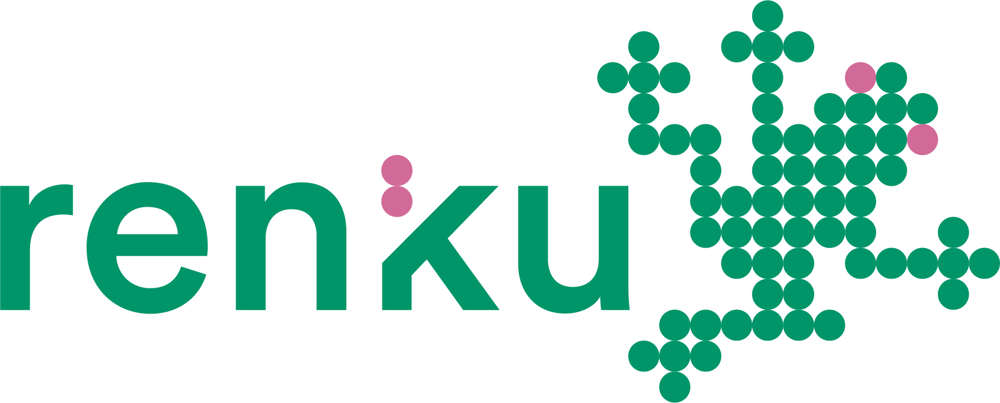

# Python Crash Course

Find here the course material for the Python Crash Course (5th, 6th, 12th, and 13th October 2026) offered in the Transferable Skills programme ([course description](https://fortbildung.unibas.ch/courses/organizer/scientific-tools/python-crash-course-for-beginners-303383)) of the University of Basel.

Do you want to immediately dive into the course material? Check out [Renku lab](https://renkulab.io/v2/projects/samarinm/python-crash-course) and click "Launch" to run the notebooks without any installation!

<p align="center">
    <a href="https://renkulab.io/v2/projects/samarinm/python-crash-course">
        
    </a>
</p>

## Updates

* Thursday, 1nd October: Upload notebooks of first week.
* *Monday, 5th October: Update notebooks and solutions of first day.*

## Set up Python

In order to set up Python on your own machine, I recommend using [Anaconda](https://www.anaconda.com/download). Follow the steps outlined in my [YouTube instruction video](https://youtu.be/-RJnYbxVZTg) to install Python and getting started with the Jupyter notebooks.

If you are more advanced and/or Anaconda is already set up on your machine, open up a terminal and create a new environment with the necessary libraries through

```
conda env create -f environment.yml
``` 

activate the environment via

```
conda activate pythonCC
``` 

and start Jupyter lab with

```
jupyter lab
``` 
